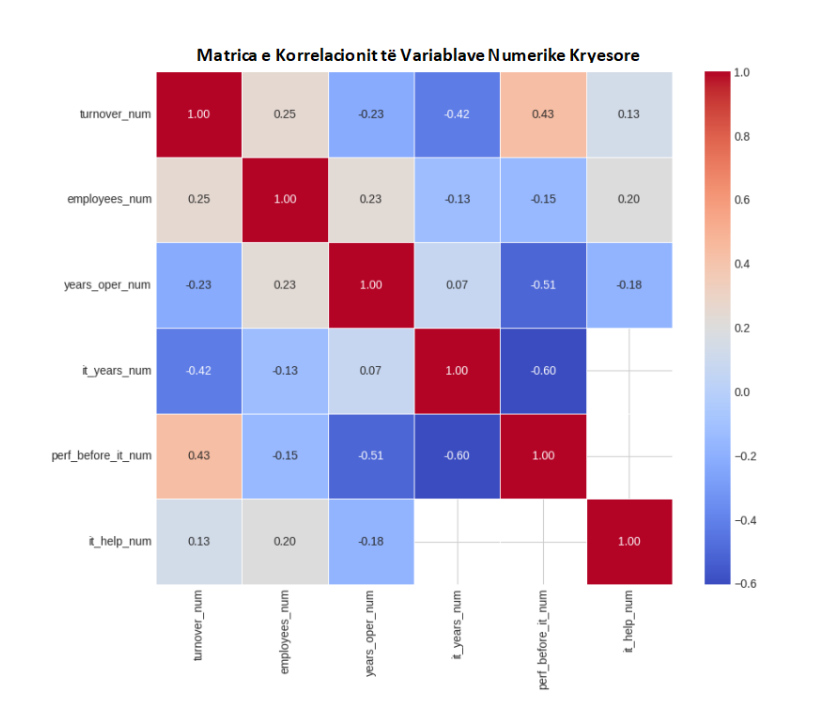
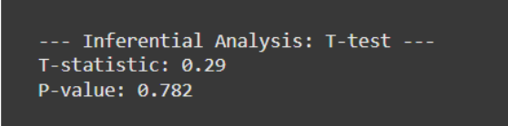
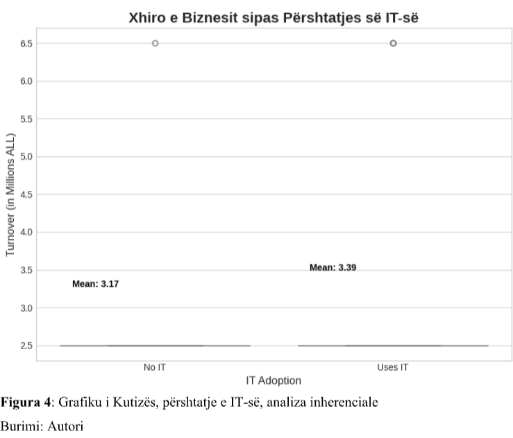
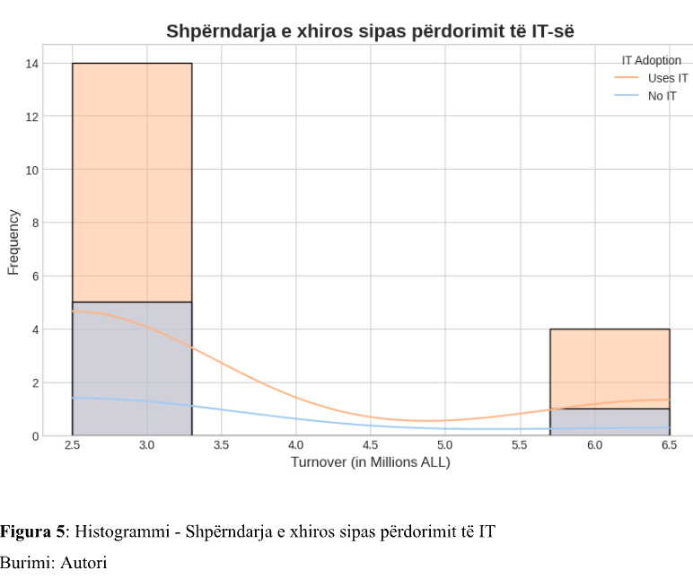

Project: IT Adoption and Business Performance Analysis
Overview

This project performs a statistical analysis to examine the impact of information technology (IT) adoption on the business performance—specifically turnover and employment—of commercial farms and agribusinesses in Albania. 

Key Features
•	Data Cleaning: Transforms raw survey data into machine-readable numeric formats, including mapping categorical variables (turnover, years of operation, IT integration) into numerical ranges. 

•	Statistical Analysis: Includes independent two-sample t-tests to compare turnover between businesses that utilize IT systems and those that do not. 

•	Visualization: Generates professional box plots and histograms to visualize turnover distributions and IT adoption trends. 

•	Correlation & Regression: Features a correlation matrix and an Ordinary Least Squares (OLS) regression model to assess the relationships between multiple business variables. 

Technologies Used

•	Python

•	Pandas & NumPy (Data manipulation) 

•	Matplotlib & Seaborn (Data visualization) 

•	SciPy & Statsmodels (Statistical testing and regression)

### Research Visualizations

**Correlation Matrix**

**Statistical Analysis Results**

**Box Plot: IT Adoption**

**Histogram: Turnover Distribution**

### Research Visualizations

**Correlation Matrix**

**Statistical Analysis Results**

**Box Plot: IT Adoption**

**Histogram: Turnover Distribution**

